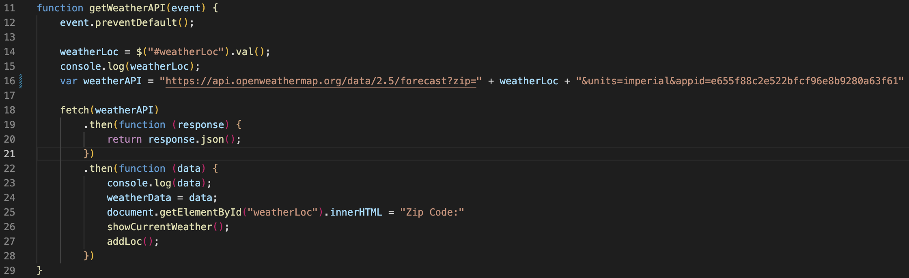
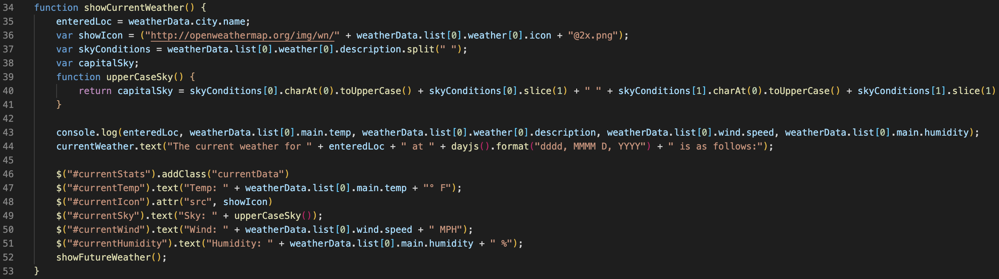

# Weather Dashboard

## Description

This is a application designed to inform you of the current weather conditions, as well as future weather conditions. A user enters a zip code and is returned conditions. It also creates a list of previous locations to create a shortcut to check the past location. I built this application so that I could easily check the weather. It is a simplified format of the exact conditions I wish to see. This was built using a server-side api. 

## Usage

When a user visits the site: https://tylerdins88.github.io/weather-dashboard/
they are asked to enter a zip code. Upon entry, the user is then given the data described in the description. There is no installation to use this site. It is built using a server-side api for weather. Once this data is acquired using a fetch request, it is parsed, and then displayed to the page. 

This first image shows how the fetch request happens. 

The second image shows I parsed through the data to find the information I was seeking. I then amended this information in a polished format to my HTML using CSS. 

## API's

OpenWeather 
jQuery
Bootstrap
Dayjs